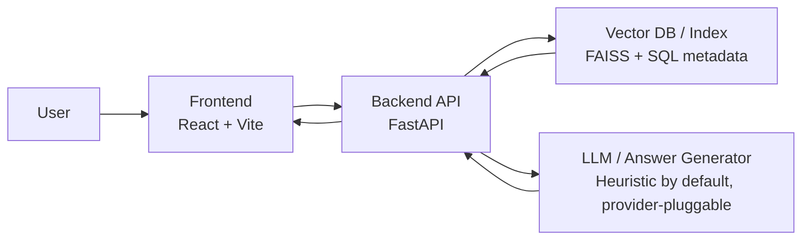

# Callisto — Portfolio RAG Knowledge Platform

[](https://enterprise-rag.onrender.com)
[](https://render.com)


A demo-scale retrieval-augmented generation (RAG) system for document indexing, hybrid search, and citation-grounded answer assembly.

## Recruiter-facing summary
Callisto is a full-stack portfolio project that shows how I design and implement a practical RAG pipeline, from ingestion to retrieval and answer assembly. I built it to be inspectable and honest: the default stack uses deterministic hash-based embeddings, weighted reranking, and heuristic answer synthesis so the whole workflow can run locally without paid model APIs. I am a **University of Maryland student studying Information Science and Electrical Engineering with a Business minor**.

## What this project demonstrates
- Building a complete document QA workflow: ingest → chunk → index → retrieve → synthesize answers with citations.
- Implementing hybrid retrieval patterns that combine lexical and vector signals.
- Structuring a FastAPI backend with explicit service boundaries for ingestion, retrieval, reranking, and answer assembly.
- Designing demo-safe defaults (local embeddings + heuristic synthesis) that can be swapped for real model providers.

## Tech stack
- **Backend:** FastAPI, SQLAlchemy, Pydantic, Alembic
- **Frontend:** React, Vite
- **Retrieval/Data:** PostgreSQL, FAISS, lexical retrieval (BM25-style scoring)
- **Dev tooling:** Docker Compose, Makefile, pytest

## Architecture overview
Callisto follows a straightforward RAG flow: documents are uploaded, chunked, embedded/indexed, retrieved through hybrid search, then reordered with weighted reranking before template-based answer assembly.

- Architecture notes: [`docs/ARCHITECTURE.md`](docs/ARCHITECTURE.md)
- API surface: [`docs/API.md`](docs/API.md)

Implementation honesty notes:
- Answers are assembled via **heuristic answer synthesis** (template-based), not remote LLM generation by default.
- Candidate ordering uses **weighted reranking** over retrieval features, not cross-encoder reranking.
- Embeddings are **deterministic hash-based** by default so the app works offline/local-first; you can swap in a real embedding model.

## Architecture Diagram


## How to run locally
### One-command setup
```bash
make bootstrap
```

### One-command app start (Docker)
```bash
make dev
```

Then open:
- Frontend: `http://localhost:5173`
- API docs: `http://localhost:8000/docs`

Seeded users:
- `admin@calisto.ai` / `password123`
- `member@calisto.ai` / `password123`
- `viewer@calisto.ai` / `password123`

## Frontend Setup
Use this if you want to run the React frontend independently while developing against a separately running backend API.

1. Install frontend dependencies:
   ```bash
   cd frontend
   npm install
   ```
2. Configure environment variables (create `frontend/.env`):
   ```bash
   VITE_API_BASE_URL=http://localhost:8000
   ```
   Optional variables you may use in local development:
   - `VITE_APP_NAME=Callisto`
   - `VITE_ENABLE_DEVTOOLS=true`
3. Start the frontend dev server:
   ```bash
   npm run dev
   ```
4. Open `http://localhost:5173` and ensure your backend is running (for example: `cd backend && uvicorn app.main:app --reload --port 8000`).

## Demo workflow
1. Run `make bootstrap` (first time) and `make dev`.
2. Sign in as `admin@calisto.ai`.
3. Open **Documents** and upload one of the files from `data/samples/` (or paste text content).
4. Open **Chat** and ask a question tied to that document.
5. Review citations/snippets returned with the answer.
6. (Optional) Use `python scripts/evaluate_retrieval.py` to run the sample retrieval evaluation set against the local API.

## Screenshots / Portfolio Preview
Repository screenshots are listed in [`docs/screenshots/README.md`](docs/screenshots/README.md).

Current screenshots:
- `docs/screenshots/dashboard.png`
- `docs/screenshots/documents.png`
- `docs/screenshots/chat.png`
- `docs/screenshots/admin.png`
- `docs/screenshots/api-docs.png`
- `docs/screenshots/audit.png`
- `docs/screenshots/metrics.png`

Design/portfolio page:
- [`docs/preview/index.html`](docs/preview/index.html)

## Architecture Decisions
- Chunking strategy: [`docs/chunking-strategy.md`](docs/chunking-strategy.md)

## Limitations and future work
- Default embeddings are deterministic/hash-based, so semantic quality is limited compared with modern embedding APIs.
- Answer synthesis is template-based; integrating a real LLM provider is planned but not required for local demo use.
- Retrieval is tuned for demo-scale local datasets, not large hosted corpora.
- CI focuses on linting and backend tests; deployment automation can be extended further.

## Resume bullets
- [`docs/resume-bullets.md`](docs/resume-bullets.md)

## License
- [MIT](LICENSE)
